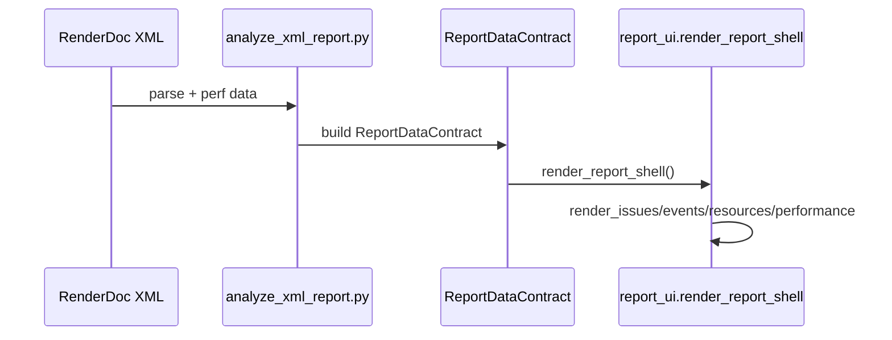
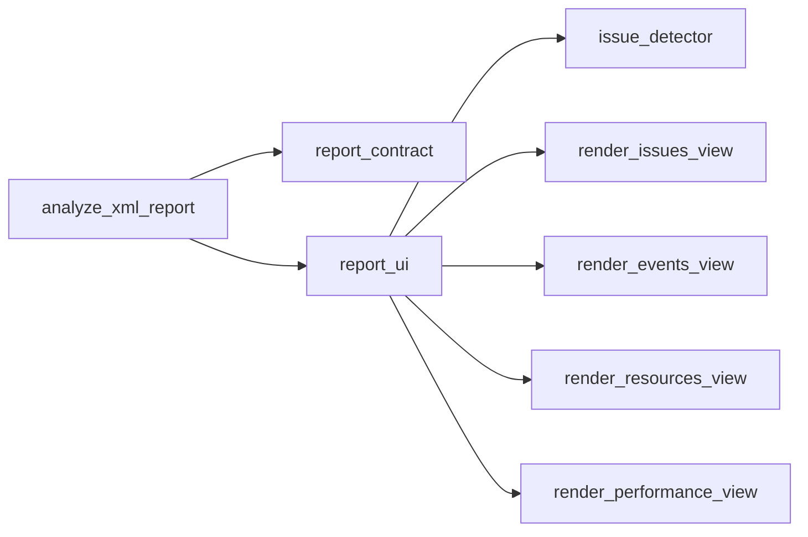

# UI 重构升级总结（2026-02-01）

> 目标读者：新成员教学 + 项目汇报  
> 文档来源：严格对照计划 `plans/2026-02-01-155453-Codex01-UI-Refactor-Summary-Doc.md`

---

## 计划对照表（Plan → Summary）
| 计划条目 | 文档位置 | 说明 |
|---|---|---|
| Goal | 设计理念 / 目标与范围 | 对应“重构升级总结”目标 |
| Architecture | 框架图 / 代码调用图 | UI 四视图 + 数据契约链路 |
| Success Criteria | 验收要点 | 目标可检查点 |
| Evidence | 代码引用 | 文件/关键入口 |
| Risks | 风险与缺口 | 当前风险点 |
| Game Dev Addendum | 游戏开发注意点 | 资源、管线、崩溃记录 |

---

## 设计理念（WHY）
**教学视角**：  
- 以前三套报告各自解析数据、渲染页面，容易出现“同一捕获在不同报告中数据不一致”的问题。  
- 现在用 `ReportDataContract` 统一数据入口，UI 只负责展示。  

**汇报视角**：  
- 统一口径后，所有报告可用一套视图验证（Issues/Events/Resources/Performance），减少维护成本与验收成本。  

---

## 目标与范围（WHAT）
**目标**  
1. 单文件总结报告，解释 v2 UI 架构。  
2. 框架图/流程图/调用图完整且可追溯。  
3. 体现“问题驱动 + 渐进迁移 + 可追溯”。  

**范围**  
- In Scope：v2 UI 重构、Report Contract、Issue Detector、四视图壳层  
- Out of Scope：UI 细节实现、compare mode、replay 路线  

---

## 框架图（WHAT / Architecture）
```mermaid
graph TD
  A[analyze_xml_report.py] --> B[ReportDataContract]
  B --> C[build_manifest()]
  B --> D[report_ui.render_report_shell]
  D --> E[Issues View]
  D --> F[Events View]
  D --> G[Resources View]
  D --> H[Performance View]
  D --> I[issue_detector.detect_all_issues]
```

---

## 流程图（HOW / Data Flow）


---

## 代码调用图（Call Graph）


---

## 模块职责（WHAT / WHY / HOW）
| 模块 | WHAT | WHY | HOW |
|---|---|---|---|
| analyze_xml_report.py | v2 报告入口 | 统一生成流程 | XML 解析 → Contract → UI |
| report_contract.py | 数据契约 + Manifest | 统一口径 | build_manifest + coverage |
| report_ui.py | 四视图壳层 | 降低维护成本 | render_report_shell |
| issue_detector.py | 问题聚合 | 快速定位瓶颈 | detect_all_issues |

---

## 验收要点（Success Criteria）
- 文档包含“设计理念 / 框架图 / 流程图 / 调用图”。  
- 每张图至少覆盖 `analyze_xml_report.py`、`report_contract.py`、`report_ui.py`。  
- 文档 ≤ 800 行。  

---

## 代码引用（Evidence）
- v2 入口：`scripts/rdc_analyzer/analyze_xml_report.py:1717-1737`  
- 数据契约：`scripts/rdc_analyzer/report_contract.py:24-132`  
- UI 壳层：`scripts/rdc_analyzer/report_ui.py:747-820`  
- Issue Detector：`scripts/rdc_analyzer/core/issue_detector.py:160-210`  

---

## A/C 回归记录（2026-02-01）
**样本：大远景（Vulkan）**  
- XML：`D:\backup\rdc_reports\大远景\大远景.xml`  
- HTML(v2)：`D:\backup\rdc_reports\大远景\大远景_report_v2.html`  
- 解析统计：Events 1624 / DrawCalls 1568 / RenderPass 43  
- 资源统计：Textures 1087 / Buffers 2779 / Shaders 339  
- Issues：0 critical / 15 warning / 763 info（Score 0.0/100）  
- UI 验证：四视图标签存在；Issues/Resources/Performance 均有内容  

**样本：战斗特写1（Vulkan）**  
- XML：`D:\backup\rdc_reports\战斗特写1\战斗特写1.xml`  
- HTML(v2)：`D:\backup\rdc_reports\战斗特写1\战斗特写1_report_v2.html`  
- 解析统计：Events 171 / DrawCalls 97 / RenderPass 31  
- 资源统计：Textures 138 / Buffers 155 / Shaders 113  
- Issues：0 critical / 5 warning / 97 info（Score 0.0/100）  
- UI 验证：四视图标签存在；Issues/Resources/Performance 均有内容  

> 注：Issues/资源卡数量从 HTML 内标记统计而来，仅用于验收可用性，不代表最终规则口径。

---

## 风险与缺口（Risks）
- **IssueDetector 口径**：当前为新规则集，需明确与 `rules/*` 的映射关系。  
- **Manifest 输出**：建议明确是否落盘 `report_manifest.json` 用于验收。  

---

## 游戏开发注意点（Game Dev Addendum）
**Memory & Resource Budget**  
- 大纹理列表需分页/懒加载，避免一次性渲染超长 DOM。  

**Asset Pipeline**  
- 纹理导出目录与 Manifest 必须保持一致，避免资源错配。  

**Crash Repro + Dumps/Symbols**  
- 若 UI 生成失败，记录 traceback + commit hash，方便回放定位。  
