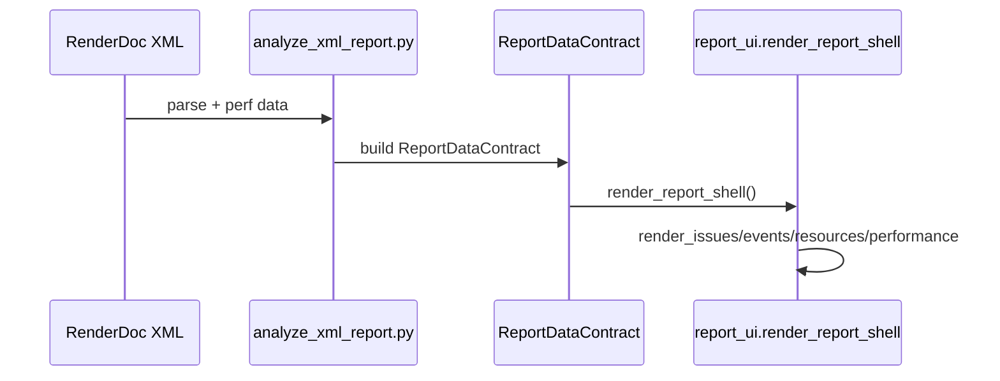
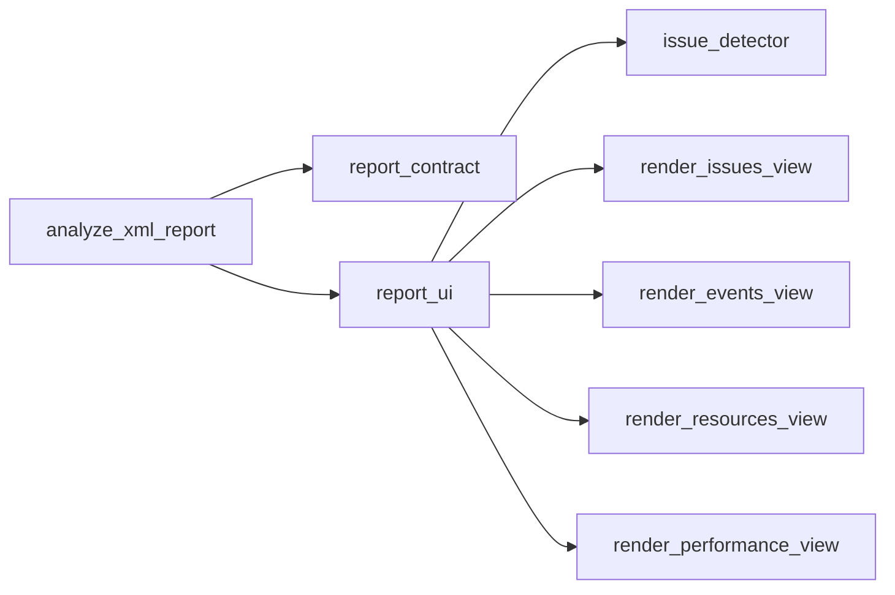

# UI 重构升级总结（2026-02-01）

> 目的：总结 v2 UI 重构的框架、流程、设计理念与调用关系，保证后续维护可追溯。

## 设计理念（WHY）
- **统一数据口径**：用 `ReportDataContract` 作为唯一数据契约，避免三套报告口径分裂。  
- **问题驱动**：Issues 视图优先呈现可执行建议，事件/资源用于溯源。  
- **渐进迁移**：通过 `--ui-version=v2` 保持旧版可用，降低迁移风险。  
- **可追溯链路**：每条问题都能追溯到资源或 EID。  

## 框架图（WHAT / Architecture）
```mermaid
graph TD
  A[analyze_xml_report.py] --> B[ReportDataContract]
  B --> C[build_manifest()]
  B --> D[report_ui.render_report_shell]
  D --> E[Issues View]
  D --> F[Events View]
  D --> G[Resources View]
  D --> H[Performance View]
  D --> I[issue_detector.detect_all_issues]
```

## 流程图（HOW / Data Flow）


## 代码调用图（Call Graph）


## 模块职责（WHAT / WHY / HOW）
| 模块 | WHAT | WHY | HOW |
|---|---|---|---|
| analyze_xml_report.py | v2 报告入口 | 统一生成流程 | XML 解析 → Contract → UI |
| report_contract.py | 数据契约 + Manifest | 统一口径 | build_manifest + coverage |
| report_ui.py | 四视图壳层 | 降低维护成本 | render_report_shell |
| issue_detector.py | 问题聚合 | 快速定位瓶颈 | detect_all_issues |

## 关键调用链（带代码引用）
- `analyze_xml_report.py` → `ReportDataContract`（v2 分支入口）  
- `ReportDataContract` → `build_manifest`（覆盖率统计）  
- `render_report_shell` → `render_*_view`（四视图渲染）  

## 当前缺口 / 风险点
- **IssueDetector 口径**：当前为新规则集，需明确与 `rules/*` 的映射关系。  
- **Manifest 输出**：建议明确是否落盘 `report_manifest.json` 用于验收。  

