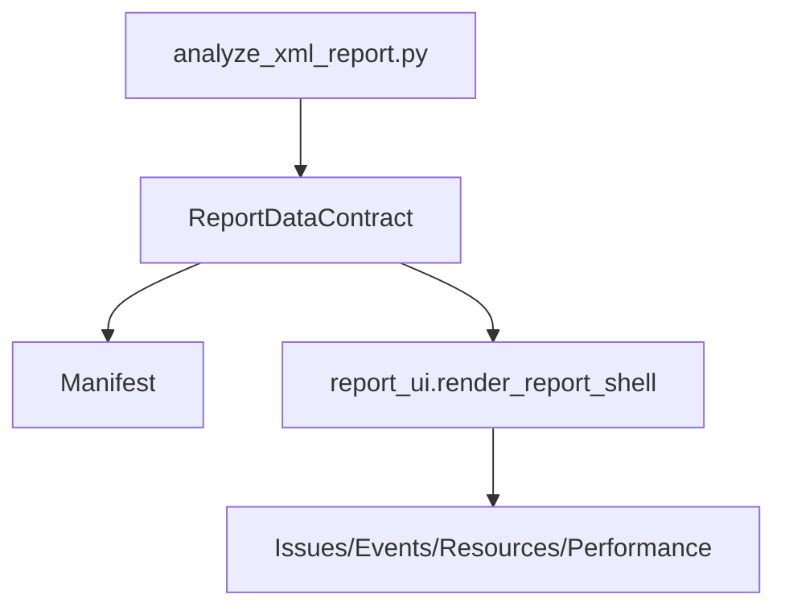
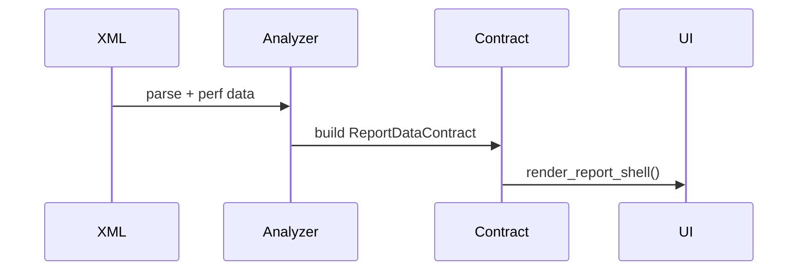
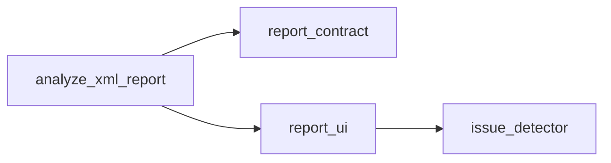

# UI Refactor Summary Doc Plan

> **For Claude:** REQUIRED SUB-SKILL: Use superpowers:executing-plans to implement this plan task-by-task.

**Version:** 2026-02-01  
**Owner:** Codex01  
**Last Updated:** 2026-02-01  
**Plan File:** `plans/2026-02-01-155453-Codex01-UI-Refactor-Summary-Doc.md`

---

## Plan Metadata
- Version: 2026-02-01
- Owner: Codex01
- Last Updated: 2026-02-01
- Plan File: `plans/2026-02-01-155453-Codex01-UI-Refactor-Summary-Doc.md`

## Goal
- 输出一份“本次 UI 重构升级总结文档”，包含框架图、流程图、设计理念、代码调用图，并明确 v2 UI 的数据流与职责边界。

## Architecture
- 文档以**单文件**为主（不超过 800 行）。  
- 使用 Mermaid/ASCII 绘制：框架图、流程图、调用图。  
- 所有图示必须可追溯到代码入口与关键模块。  

## Tech Stack
- Markdown
- Mermaid（graph/sequence）
- ASCII（必要时）

## Success Criteria (measurable)
- 文档包含四部分：设计理念、框架图、流程图、代码调用图。  
- 每张图至少覆盖 3 个核心模块：`analyze_xml_report.py`、`report_contract.py`、`report_ui.py`。  
- 文档不超过 800 行。  

## Acceptance Criteria
- [ ] 文档可读、结构清晰  
- [ ] 图示与代码路径一致  
- [ ] 关键模块职责（WHAT/WHY/HOW）明确  

## Verification Commands
- `rg -n "设计理念|框架图|流程图|代码调用图" docs/analysis/codex_rdc_analyzer/2026-02-01-ui-refactor-summary.md` (Expected: 4 个标题都存在)  
- `rg -n "analyze_xml_report.py|report_contract.py|report_ui.py" docs/analysis/codex_rdc_analyzer/2026-02-01-ui-refactor-summary.md` (Expected: 至少各出现一次)  

## Evidence
- v2 入口：`scripts/rdc_analyzer/analyze_xml_report.py:1717-1737`  
- 数据契约：`scripts/rdc_analyzer/report_contract.py:24-132`  
- UI 壳层：`scripts/rdc_analyzer/report_ui.py:747-820`  
- Issue Detector：`scripts/rdc_analyzer/core/issue_detector.py:160-210`  

## Estimation
- Effort: 2–4 hours  
- Story Points: 2  
- Original Estimate: 0.5 day  

## Risk Register
| Risk | Impact | Likelihood | Mitigation |
|---|---|---|---|
| 文档过长超 800 行 | Medium | Medium | 控制在单文件 + 表格精简 |
| 图示与代码不一致 | High | Low | 使用明确文件/函数名标注 |

## Game Dev: Memory & Resource Budget (Leak Checks)
- 文档强调大规模资源列表的渲染风险（避免 UI 一次性渲染超长列表）。  

## Game Dev: Asset Pipeline
- 文档强调纹理导出路径与 Manifest 一致性。  

## Game Dev: Crash Repro + Dumps/Symbols
- 文档强调：若 UI 生成失败，记录 traceback 与 commit hash。  

---

## Scope
**In Scope**  
- 编写总结文档  
- 绘制框架图/流程图/代码调用图  

**Out of Scope**  
- 代码修改  
- UI 功能扩展  

## Assumptions
- 文档存放于 `docs/analysis/codex_rdc_analyzer/`  

## Repo / File List (line refs)
- `scripts/rdc_analyzer/analyze_xml_report.py:1717-1737`  
- `scripts/rdc_analyzer/report_contract.py:24-132`  
- `scripts/rdc_analyzer/report_ui.py:747-820`  
- `scripts/rdc_analyzer/core/issue_detector.py:160-210`  

## Approach (Pseudo-code)
```
create md file
add sections (principles/diagrams/call graph)
add Mermaid diagrams
add WHAT/WHY/HOW table
verify headings + references
```

## Impact Analysis
- 文档新增不会影响运行逻辑，但需保证与现有代码一致。  

## Build/Test/Lint Quick Guide (record only)
- 无需构建或测试（仅文档）。

---

## Task Checklist (2–5 min steps)

### Task 1: 创建文档骨架
**Files:**  
- Create: `docs/analysis/codex_rdc_analyzer/2026-02-01-ui-refactor-summary.md`

**Step 1: 写入骨架**
```markdown
# UI 重构升级总结（2026-02-01）

## 设计理念（WHY）
- ...

## 框架图（WHAT/Architecture）


## 流程图（HOW/Data Flow）


## 代码调用图（Call Graph）

```

**Step 2: 验证标题存在**  
Run: `rg -n "设计理念|框架图|流程图|代码调用图" docs/analysis/codex_rdc_analyzer/2026-02-01-ui-refactor-summary.md`  
Expected: 4 个标题都存在

**Step 3: Commit**
```bash
git add docs/analysis/codex_rdc_analyzer/2026-02-01-ui-refactor-summary.md
git commit -m "docs(rdc-analyzer): add UI refactor summary skeleton"
```

### Task 2: 补齐设计理念与职责表
**Files:**  
- Modify: `docs/analysis/codex_rdc_analyzer/2026-02-01-ui-refactor-summary.md`

**Step 1: 添加 WHAT/WHY/HOW 表**
```markdown
## 模块职责（WHAT / WHY / HOW）
| 模块 | WHAT | WHY | HOW |
|---|---|---|---|
| analyze_xml_report.py | 生成 v2 报告入口 | 提供统一入口 | 解析 XML → contract → UI |
| report_contract.py | 数据契约 + manifest | 统一口径 | build_manifest + coverage |
| report_ui.py | 四视图壳层 | 降低维护成本 | render_report_shell |
| issue_detector.py | 问题聚合 | 快速定位瓶颈 | detect_all_issues |
```

**Step 2: 验证关键模块引用**  
Run: `rg -n "analyze_xml_report.py|report_contract.py|report_ui.py" docs/analysis/codex_rdc_analyzer/2026-02-01-ui-refactor-summary.md`  
Expected: 每个模块至少 1 次引用

**Step 3: Commit**
```bash
git add docs/analysis/codex_rdc_analyzer/2026-02-01-ui-refactor-summary.md
git commit -m "docs(rdc-analyzer): add UI refactor responsibilities table"
```

### Task 3: 完善调用图与流程图描述
**Files:**  
- Modify: `docs/analysis/codex_rdc_analyzer/2026-02-01-ui-refactor-summary.md`

**Step 1: 添加代码引用说明**
```markdown
## 关键调用链（带代码引用）
- `analyze_xml_report.py` → `ReportDataContract`（v2 分支入口）
- `ReportDataContract` → `build_manifest`（覆盖率统计）
- `render_report_shell` → `render_*_view`（四视图）
```

**Step 2: Commit**
```bash
git add docs/analysis/codex_rdc_analyzer/2026-02-01-ui-refactor-summary.md
git commit -m "docs(rdc-analyzer): document call chain with code references"
```

---

## Next Steps
- [ ] 你确认后进入 `/do` 执行 Task 1–3。  
