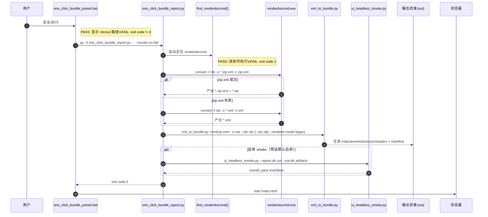

# One-click Bundle 导出：验收清单（One-click Acceptance）

> **更新日期**: 2026-02-12 | **版本**: 1.0.0
>
> 目标：把“RDC → Bundle 报告”的一键流程做成**可复现、可回归、可交接**的验收标准。
>
> 适用：你只想做浏览器视觉验证，不希望任何手动点击/串联。

---

## 1. 你需要知道的结论（TL;DR）

- 推荐入口（双击即可）：
  - `scripts/rdc_analyzer/one_click_bundle_preset.bat`
- 通用入口（可换 RDC、可换输出目录）：
  - `py -3 scripts/rdc_analyzer/one_click_bundle_report.py <input.rdc> -o <out_dir> --smoke-no-fail --smoke-no-screenshots`
- 核心策略：
  - **优先** `renderdoccmd convert -c zip.xml` 生成 `*.zip.xml + *.zip`（为真实缩略图资产做准备）
  - **失败自动回退**到 `-c xml`（保证“报告一定能出”，而不是全链路失败）
  - 自动调用 `xml_to_bundle.py` 生成 legacy 页面 Bundle（默认兼容路径）
  - 可选跑 `ui_headless_smoke.py` 做无 GUI 回归门禁

---

## 2. 输出物验收（最重要）

### 2.1 必须产出的文件

给定输出目录 `<out_dir>`，必须存在并且“刚刚更新”的文件：

- `<out_dir>/index.html`
- `<out_dir>/events.html`（可选：legacy 路由可能缺失）
- `<out_dir>/textures.html`
- `<out_dir>/shaders.html`
- `<out_dir>/manifest.json`

判定：
- ✅ PASS：5 个文件均存在，且 `LastWriteTime` 刷新到本次执行时间
- ❌ FAIL：缺页 / 时间戳没更新 / 只生成部分文件

### 2.2 数据健康度（允许的“空态”）

`xml_to_bundle.py` 会输出数据质量提示（示例）：

- `Data quality: thumbnails X/Y, shaders Z`

判定建议：
- ✅ thumbnails：`X > 0`（理想），`X == 0` 允许但要在 UI 中有 placeholder + 提示
- ✅ shaders：`Z == 0` 在部分 capture 是正常现象（没有可提取 shader 源）
  - 要求：`shaders.html` 必须有“空态说明”，不能空白或报错

---

## 3. 流程验收（分阶段）

### 3.1 入口层

入口 A（预设）：
- `scripts/rdc_analyzer/one_click_bundle_preset.bat`

入口 B（通用）：
- `py -3 scripts/rdc_analyzer/one_click_bundle_report.py <input.rdc> -o <out_dir> ...`

判定：
- ✅ PASS：控制台能打印 `[RUN] convert-zipxml` / `[RUN] xml-to-bundle`，并最终出现 `[DONE]`
- ❌ FAIL：只打印了开头路径，随后无输出且 CPU 为 0（疑似卡死）

### 3.2 renderdoccmd 转换层（zip.xml 优先 + xml 回退）

优先路径：
- `renderdoccmd.exe convert -f input.rdc -o output.zip.xml -c zip.xml`

回退路径：
- `renderdoccmd.exe convert -f input.rdc -o output.xml -c xml`

判定：
- ✅ PASS：至少有一种转换成功产出中间文件（`*.zip.xml` 或 `*.xml`）
- ❌ FAIL：两种都失败，脚本退出码为 3

提示：
- 如果 renderdoccmd 报：`Need an input filename (-f)`
  - 说明当前 CLI 要求显式 `-f <input>`，不能把输入文件放在最后。

### 3.3 Bundle 生成层（xml_to_bundle）

调用形态（zip.xml 模式）：
- `py -3 scripts/rdc_analyzer/xml_to_bundle.py output.zip.xml -o out_dir --zip output.zip --rdc input.rdc`

判定：
- ✅ PASS：生成 legacy 页面 + manifest，并打印缩略图/Shader 的数据质量统计（`events.html` 在 legacy 路由可选）
- ❌ FAIL：退出码 4 或输出目录缺页

### 3.4 Headless Smoke（无 GUI 回归门禁）

调用形态：
- `py -3 scripts/rdc_analyzer/tools/ui_headless_smoke.py --report-dir <out_dir> --out-dir <artifact_dir> ...`

判定：
- ✅ PASS：`ui_smoke_result.json` 里 `overall_pass: true`
- ❌ FAIL：`overall_pass: false` 或脚本退出码 5

---

### 3.5 Snapshot 路由补充（非 one-click 默认）

如果你需要 `snapshot.v1.json` 与 snapshot 页面集合（含 `events.html` + `recommendations.html`），请直接调用：

- `py -3 scripts/rdc_analyzer/xml_to_bundle.py output.zip.xml -o out_dir --zip output.zip --rdc input.rdc --emit-snapshot-v1 --renderer-mode snapshot`

## 4. 视觉验收（你最终看的东西）

打开：
- `file:///<out_dir>/index.html`
- `file:///<out_dir>/textures.html`
- `file:///<out_dir>/events.html`
- `file:///<out_dir>/shaders.html`

建议顺序：
1) index（总览是否“仪表盘化”、统计是否合理）
2) textures（滚动/搜索/筛选/选中更新属性是否正常）
3) events（右侧属性区可读性、滚动条、对齐）
4) shaders（空态是否专业、按钮布局是否挤压）

---

## 5. 时序图（执行链路）

---

## 6. 常见故障快速定位

- 只看到 `Converted ... to ...zip.xml`，但长时间没有后续输出：
  - 通常卡在 `xml_to_bundle.py` 的解析/生成阶段（大 capture 会比较久）
  - 观察：进程 CPU 是否持续上升；输出目录时间戳是否更新

- thumbnails 全不可读 / 看起来像噪点：
  - 可能是 zip 资产不完整、格式解码失败、或缩略图生成策略不适配该 capture
  - 建议：先看 `Data quality: thumbnails X/Y` 是否为 0

- `shaders 0`：
  - 允许（capture 没有可提取 shader debug/source），但 UI 必须空态友好

